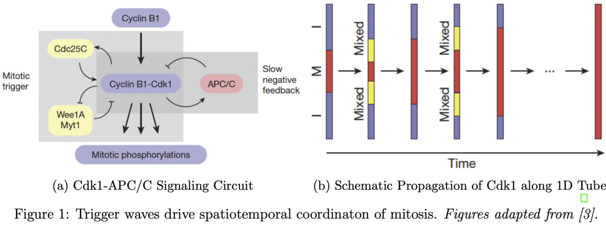

# Dynamical Modeling of Biological Systems

### Cell-Cycle Oscillator and Mitotic Trigger Wave-driven Spatiotemporal Coordination

- [Project Summary Report [PDF]](./project_mitotic-trigger-waves/docs/project-report.pdf).
- [Code Modules](./project_mitotic-trigger-waves).
- [Analysis Code Snapshot [Matlab LiveScript PDF]](./project_mitotic-trigger-waves/docs/code-notebook.pdf).

### Experiments and Analyses

- EX09: One-dimensional diffusion analysis.
- PS04: Effect of number of molecules on the quality of Gillespie simulations.
- PS05: Turing systems.
